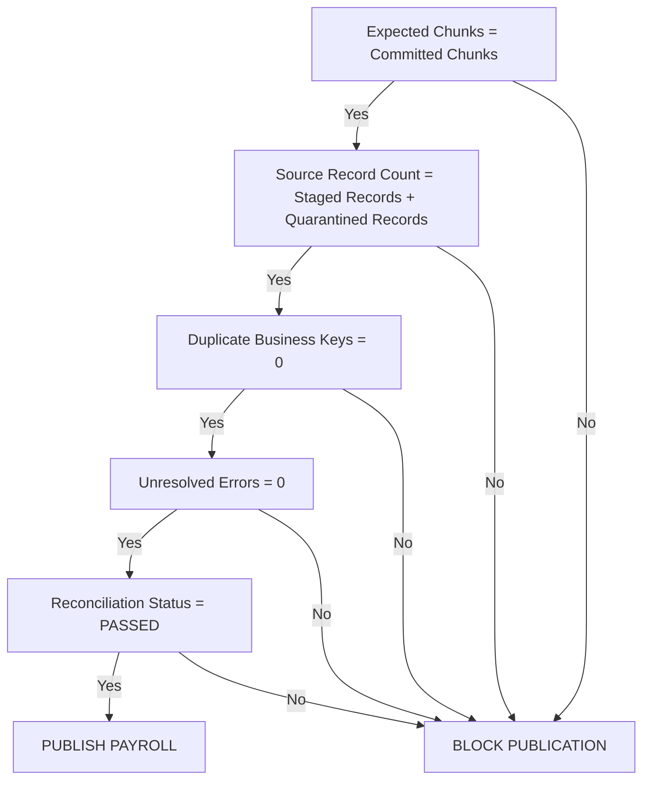

# Project 01 — Payroll Close Under a Hard Memory Ceiling

## Overview

A fictional industrial manufacturer must consolidate a **12 GB UKG Pro Workforce Management time export** before payroll cutoff while operating a Boomi Atom constrained to a **2 GB JVM heap**.

The purpose of this project is to engineer a payroll-close integration that remains stable when the source dataset is substantially larger than the available runtime memory.

The solution must support two source modes:

1. A paginated UKG-style REST API.
2. A monolithic JSON export.

The integration must process the complete workforce dataset without materializing the entire export in memory, while preserving enough durable execution state to recover from runtime crashes, temporary-storage exhaustion, retries, and partially completed processing.

> A payload larger than the runtime is not inherently a problem. Allowing the runtime to treat that payload as one in-memory document is.

---

## Business Context

Payroll close is approaching its cutoff.

The organization must extract workforce time data from UKG Pro WFM, consolidate employee time and pay information, stage the results in SQL Server, generate the payroll transmission file, and publish it to the payroll processor through SFTP.

The production Atom has the following constraint:

```text
JVM Heap:     2 GB
Source Export: 12 GB
```

The integration cannot solve this problem by simply allocating more memory.

The architecture must instead guarantee bounded processing throughout the pipeline.

The payroll-close process must also survive operational failures without restarting the complete extract.

---

## Primary Systems

| System | Purpose |
|---|---|
| UKG-style REST Simulator | Workforce time source |
| Monolithic Export Simulator | Large-file source |
| Boomi | Integration runtime and orchestration |
| SQL Server | Durable staging and control plane |
| SFTP | Payroll delivery |
| Payroll CSV | Final outbound payroll artifact |

---

## Source Modes

### Mode A — Paginated REST

The source exposes workforce records through bounded API pages.

Example request:

```http
GET /ukg/time-export?pageSize=5000&pageToken=abc123
```

Example response:

```json
{
  "records": [],
  "page": {
    "number": 148,
    "count": 5000,
    "nextToken": "abc124",
    "hasMore": true
  }
}
```

Each page represents a potential recoverable processing boundary.

---

### Mode B — Monolithic JSON Export

The source exposes the complete export as one logical JSON document.

```text
ukg-payroll-close-export.json
Logical Size: 12 GB
```

The integration must not assume that a Boomi Split operation automatically protects the Atom from memory pressure.

If a connector, parser, profile, map, or script has already materialized the complete document, splitting afterward is too late.

The monolithic path must establish a bounded processing boundary before unsafe materialization occurs.

---

## Architectural Trap

The obvious implementation is also the dangerous implementation:

```text
12 GB JSON
    |
    v
Boomi Connector
    |
    v
JSON Profile
    |
    v
Split
    |
    v
Map
```

This design can fail before the Split shape provides any protection.

The project must identify which runtime stages:

- stream data
- buffer data
- materialize complete documents
- create temporary files
- duplicate documents
- increase heap pressure
- increase temporary-disk pressure

Parallel Flow Control also introduces risk.

If one worker requires significant working memory, multiple workers may multiply that pressure inside the same JVM.

---

## Engineering Objectives

The completed implementation must demonstrate:

- bounded memory consumption
- bounded concurrency
- durable chunk manifests
- restart-safe processing
- deterministic reconciliation
- oversized-employee handling
- durable checkpoints
- duplicate prevention
- safe disk-backed processing
- atomic payroll publication
- measurable runtime behavior

---

## Required Guarantees

The implementation must prove:

<table>
  <thead>
    <tr>
      <th align="left">Guarantee</th>
      <th align="left">Expected Result</th>
    </tr>
  </thead>
  <tbody>
    <tr>
      <td align="left">Complete source restart after recoverable failure</td>
      <td align="left"><strong>NO</strong></td>
    </tr>
    <tr>
      <td align="left">Lost committed records</td>
      <td align="left"><strong>0</strong></td>
    </tr>
    <tr>
      <td align="left">Duplicate payroll records</td>
      <td align="left"><strong>0</strong></td>
    </tr>
    <tr>
      <td align="left">Unaccounted source records</td>
      <td align="left"><strong>0</strong></td>
    </tr>
    <tr>
      <td align="left">Publication with unresolved reconciliation</td>
      <td align="left"><strong>BLOCKED</strong></td>
    </tr>
    <tr>
      <td align="left">Full 12 GB document loaded into JVM heap</td>
      <td align="left"><strong>NO</strong></td>
    </tr>
  </tbody>
</table>

Technical execution success alone is not sufficient.

The payroll-close process is complete only when the integration can prove that the business population is complete and reconciled.

---

## High-Level Architecture

```text
                          SOURCE
                             |
              +--------------+--------------+
              |                             |
      Paginated REST                 Monolithic Export
              |                             |
              v                             v
       Bounded Page Fetch           Streaming / Partitioning
              |                             |
              +--------------+--------------+
                             |
                             v
                       Chunk Manifest
                             |
                             v
                     Durable Work Queue
                             |
                             v
                     Bounded Concurrency
                             |
                             v
                      Chunk Processor
                             |
              +--------------+--------------+
              |              |              |
              v              v              v
          Validation     Transformation    SQL Stage
                                             |
                                             v
                                    Payroll Aggregation
                                             |
                                             v
                                        Payroll CSV
                                             |
                                             v
                                     Publication Gate
                                             |
                                             v
                                            SFTP
```

---

## Durable Control Plane

SQL Server acts as the durable execution control plane.

Boomi process properties must not be treated as the authoritative source of recovery state for long-running payroll-close processing.

Initial control-plane entities include:

```text
integration_run
chunk_manifest
checkpoint
employee_fragment
payroll_stage
payroll_result
reconciliation_result
```

---

## Integration Run

Represents one logical payroll-close execution.

Example attributes:

```text
run_id
source_mode
source_identifier
status
started_at
completed_at
expected_chunks
completed_chunks
failed_chunks
source_record_count
processed_record_count
```

Example states:

```text
CREATED
DISCOVERING
PROCESSING
RECOVERING
RECONCILING
READY_TO_PUBLISH
PUBLISHED
FAILED
BLOCKED
```

---

## Chunk Manifest

Every independently recoverable unit of work must have a durable manifest entry.

Example attributes:

```text
chunk_id
run_id
sequence_number
source_offset_start
source_offset_end
page_token
record_count
content_hash
status
attempt_count
created_at
claimed_at
completed_at
```

Chunk states:

```text
DISCOVERED
READY
PROCESSING
COMMITTED
FAILED
QUARANTINED
```

The manifest determines what has actually been completed.

The existence of a successful Boomi execution does not.

---

## Checkpoint Rule

Checkpoint advancement must occur only after the corresponding work has been durably committed.

Correct order:

```text
PROCESS
   |
   v
VALIDATE
   |
   v
DURABLY COMMIT
   |
   v
UPDATE MANIFEST
   |
   v
ADVANCE CHECKPOINT
```

Incorrect order:

```text
ADVANCE CHECKPOINT
   |
   v
PROCESS
```

Advancing the checkpoint before durable application creates the possibility of permanent record loss after a crash.

---

## Oversized Employee Strategy

The architecture must not assume one employee always fits inside one processing document.

A pathological employee may contain an unusually large amount of historical time data.

Employee-based partitioning therefore does not provide a guaranteed upper bound.

The solution must support employee fragmentation.

Example:

```text
Employee 47291
|
+-- Fragment 0001
|   +-- Time records 1-10,000
|
+-- Fragment 0002
|   +-- Time records 10,001-20,000
|
+-- Fragment 0003
|   +-- Time records 20,001-30,000
|
+-- Fragment 0004
    +-- Remaining records
```

Logical identity is preserved using:

```text
employee_id
fragment_id
fragment_sequence
```

Fragments are aggregated only after all required fragments for the employee have been durably processed.

---

## Paginated Ingestion Strategy

Each source page becomes a bounded unit of work.

```text
Fetch Page
    |
    v
Create Manifest Entry
    |
    v
Persist Source Boundary
    |
    v
Process Page
    |
    v
Commit SQL Stage
    |
    v
Mark Chunk COMMITTED
    |
    v
Advance Checkpoint
    |
    v
Fetch Next Page
```

The continuation token must be persisted before the current process execution becomes the only location where that state exists.

---

## Monolithic Ingestion Strategy

The monolithic source requires a different architecture.

Unsafe approach:

```text
12 GB Download
    |
    v
Boomi JSON Profile
    |
    v
Split
```

Required approach:

```text
12 GB Source
    |
    v
Bounded Stream / Download
    |
    v
Disk-Backed Raw Staging
    |
    v
Streaming Parser
    |
    v
Bounded Fragments
    |
    v
Chunk Manifest
    |
    v
Boomi Processing
```

The implementation must document the first point at which the source is reduced into safely bounded work units.

---

## Bounded Concurrency

Concurrency must be determined through measurement rather than assumption.

Initial test levels:

```text
1 Worker
2 Workers
4 Workers
8 Workers
```

For each test, capture:

- peak JVM heap
- garbage collection behavior
- CPU utilization
- temporary-disk consumption
- SQL Server waits
- processing throughput
- average chunk duration
- maximum chunk duration
- failure rate

Example evidence:

| Workers | Peak Heap | Throughput | Temp Disk | Result |
|---:|---:|---:|---:|---|
| 1 | TBD | TBD | TBD | TBD |
| 2 | TBD | TBD | TBD | TBD |
| 4 | TBD | TBD | TBD | TBD |
| 8 | TBD | TBD | TBD | TBD |

The final concurrency limit must be justified by measured evidence.

---

## Failure Injection

Failure testing is a required component of this project.

A successful happy-path execution does not satisfy the acceptance criteria.

### Failure 1 — Atom Termination

Terminate the Atom at approximately 70% completion.

Example state:

```text
Total Chunks:      10,000
Committed:          6,973
Processing:             4
Ready:              3,023
```

After restart, the recovery controller must:

1. Locate the incomplete integration run.
2. Preserve all `COMMITTED` chunks.
3. Detect stale `PROCESSING` claims.
4. Return eligible stale work to `READY`.
5. Resume remaining work.
6. Reconcile the final population.

The implementation must not reprocess the complete source population.

---

### Failure 2 — Temporary Disk Exhaustion

Temporary disk must be intentionally exhausted during processing.

Expected behavior:

```text
New ingestion stops safely.
Committed chunks remain committed.
Uncommitted work remains recoverable.
The durable manifest remains intact.
Payroll publication remains blocked.
No partial payroll file is exposed.
```

After disk capacity is restored, processing must resume from durable state.

---

## Payroll Staging

Source records are first staged before payroll publication.

The stage must support:

- source lineage
- run identity
- chunk identity
- employee identity
- fragment identity
- source version
- content hash
- processing timestamp
- deduplication evidence

Example conceptual uniqueness key:

```text
run_id
+
source_business_key
+
source_version
```

The exact uniqueness model must be documented in `architecture.md`.

---

## Payroll Publication Gate

Payroll output cannot be published solely because all Boomi processes completed successfully.

Publication requires business reconciliation.



---

## Atomic Publication

The final payroll CSV must not become visible to the downstream processor while it is still being generated.

The publication contract should use:

```text
Generate
    |
    v
Validate
    |
    v
Reconcile
    |
    v
Upload Temporary Artifact
    |
    v
Verify Upload
    |
    v
Finalize / Rename
```

Example temporary file:

```text
payroll_2026_09_20.csv.part
```

Final file:

```text
payroll_2026_09_20.csv
```

The final name becomes visible only after all publication conditions are satisfied.

---

## Reconciliation

Final reconciliation must occur at more than the aggregate level.

The project must reconcile:

- source record counts
- employee counts
- time-record counts
- total hours
- pay-code totals
- payroll amounts
- oversized-employee fragments
- rejected records
- quarantined records
- duplicate business keys
- chunk counts
- content hashes
- payroll output counts

Equal totals alone do not prove correctness.

Two incorrect employee records can offset each other financially.

---

## Required Metrics

The following metrics must be captured for each major execution:

```text
Peak JVM Heap
Average JVM Heap
Peak Temporary Disk
Average Temporary Disk
Source Throughput
Transformation Throughput
Database Throughput
Payroll Generation Throughput
Total Runtime
Chunk Processing Rate
Retry Count
Failure Count
Recovery Duration
Source Record Count
Processed Record Count
Published Record Count
Duplicate Count
Lost Record Count
Quarantined Record Count
```

---

## Acceptance Criteria

### Memory

- [ ] 12 GB logical source successfully processed.
- [ ] JVM heap remains within the declared 2 GB ceiling.
- [ ] Complete source payload is never intentionally materialized in heap.
- [ ] Memory behavior is documented for major Boomi processing stages.

### Chunking

- [ ] Bounded processing units are established.
- [ ] Chunk manifests are durable.
- [ ] Oversized employees can span multiple fragments.
- [ ] Employee fragmentation does not create duplicate payroll aggregation.

### Recovery

- [ ] Atom termination is injected around 70% completion.
- [ ] Previously committed work is not restarted.
- [ ] Stale processing claims are recoverable.
- [ ] No records are lost.
- [ ] No committed payroll records are duplicated.

### Disk

- [ ] Temporary-disk exhaustion is injected.
- [ ] Processing fails safely.
- [ ] Durable state remains valid.
- [ ] Processing resumes after disk recovery.

### Concurrency

- [ ] Multiple concurrency levels are benchmarked.
- [ ] Peak heap is captured for every test.
- [ ] Peak temporary-disk use is captured.
- [ ] Final concurrency is selected from measured results.

### Reconciliation

- [ ] Source population is reconciled.
- [ ] SQL stage is reconciled.
- [ ] Payroll output is reconciled.
- [ ] Duplicate business keys equal zero.
- [ ] Lost records equal zero.
- [ ] Unresolved ambiguity blocks publication.

### Publication

- [ ] Payroll CSV is generated only after reconciliation.
- [ ] Partial files are never exposed as final payroll output.
- [ ] Final publication can be independently verified.

---

## Expected Evidence

The project must retain evidence supporting its architectural claims.

```text
evidence/
├── metrics/
├── failure-injection/
├── recovery/
└── reconciliation/
```

Evidence should include:

- heap measurements
- temporary-disk measurements
- throughput measurements
- concurrency comparisons
- Atom termination evidence
- recovery state
- manifest state before and after recovery
- disk exhaustion evidence
- source counts
- stage counts
- payroll counts
- reconciliation results
- duplicate detection results
- final publication evidence

---

## Project Structure

```text
01-payroll-close-memory/
|
├── README.md
├── architecture.md
├── requirements.md
├── assumptions.md
├── acceptance-criteria.md
|
├── boomi/
│   ├── processes/
│   ├── profiles/
│   ├── maps/
│   └── extensions/
|
├── sql/
│   ├── schema.sql
│   ├── procedures.sql
│   ├── seed.sql
│   └── reconciliation.sql
|
├── simulator/
│   ├── source/
│   └── failure-injection/
|
├── test-data/
│   ├── input/
│   └── expected/
|
├── tests/
│   ├── functional/
│   ├── failure/
│   ├── recovery/
│   └── reconciliation/
|
└── evidence/
    ├── metrics/
    ├── failure-injection/
    ├── recovery/
    └── reconciliation/
```

---

## Planned Boomi Processes

```text
P01-Orchestrator
P01-Paginated-Ingestion
P01-Monolithic-Ingestion
P01-Chunk-Processor
P01-Oversized-Employee
P01-Payroll-Aggregator
P01-Payroll-Publisher
P01-Recovery-Controller
```

---

## Implementation Sequence

### Phase 1 — Control Plane

Build the durable execution state required for:

```text
Create Run
Claim Work
Commit Work
Advance Checkpoint
Recover Stale Work
Reconcile Run
```

Primary tables:

```text
integration_run
chunk_manifest
checkpoint
employee_fragment
payroll_stage
reconciliation_result
```

### Phase 2 — Source Simulation

Implement:

- paginated UKG-style REST source
- monolithic JSON export
- oversized employee records
- deterministic dataset generation
- expected reconciliation totals

### Phase 3 — Paginated Path

Build and prove the bounded REST ingestion strategy.

### Phase 4 — Monolithic Path

Build and prove bounded processing for the monolithic export without depending on post-materialization splitting.

### Phase 5 — Failure Injection

Inject:

- Atom termination
- temporary-disk exhaustion

Verify deterministic recovery.

### Phase 6 — Performance Engineering

Benchmark:

```text
1 Worker
2 Workers
4 Workers
8 Workers
```

Establish the safe operating envelope.

### Phase 7 — Payroll Publication

Generate the final payroll CSV only after the publication gate passes.

---

## Final Success Condition

The project is complete when the integration can process the full synthetic payroll-close workload under the declared runtime constraints and demonstrate:

```text
Source Records       = Accounted Records
Lost Records         = 0
Duplicate Payroll    = 0
Unresolved Errors    = 0
Reconciliation       = PASSED
Publication Gate     = PASSED
Payroll Artifact     = VERIFIED
```

The purpose of this project is not simply to prove that Boomi can process a large file.

The purpose is to prove that the integration can maintain **bounded resource consumption, durable state, deterministic recovery, and payroll-grade correctness while processing a workload substantially larger than the runtime itself**.
